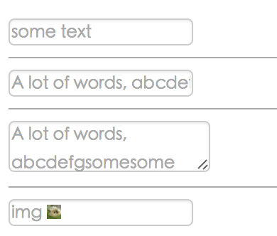

# placeholder.react

> React, text or image placeholder.

[](https://npmjs.org/package/placeholder.react)
[](https://npmjs.org/package/placeholder.react)

```shell
npm install placeholder.react --save
```

[](http://fast-flow.github.io/placeholder.react/example)

[Online](http://fast-flow.github.io/placeholder.react)

## props

<!-- MR-R{
    type: "pre",
    file: "./lib/props.js"
} -->

Read props.js [lib/props.js](lib/props.js)
